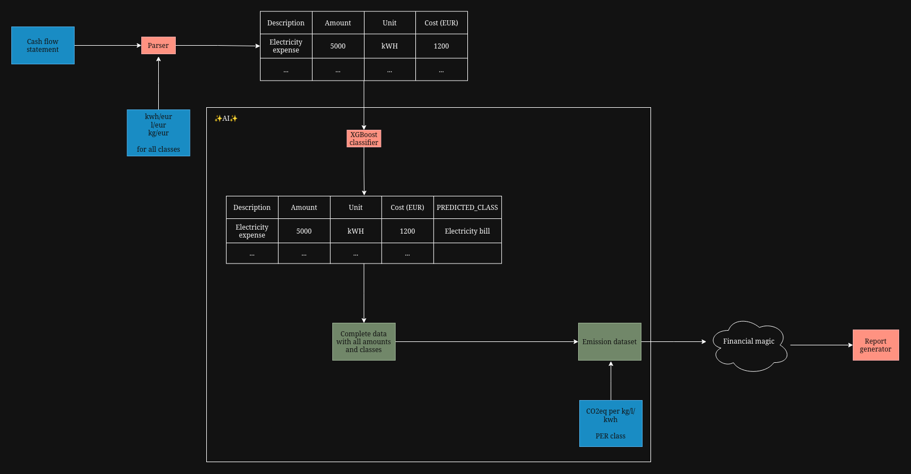

_EDITED ON DATE: 30/10/2025_

# Cash Flow Statement
It's the final hand-made cash flow statement we'll present on the 5th (if we trust it enough) to demo the product. It follows the example dataset that's on Teams.

*PROBLEM*: Not all descriptions contain the amount (kg,l,etc.) purchased. Therefore we need a way to calculate it and the `Amount per euro dataset` is needed.

# Amount per euro dataset
This is a dependency for the calculation of emissions. it can be more accurate by searching info based on the country.

Here are some sources for fuel prices, more could be neeeded:
- https://teseo.clal.it/en/?section=gasolio_agricolo
- https://www.cargopedia.net/tools

# Parser
A python script that:
- reads the cash flow statement
- accepts different formats of the same unit of measurement (e.g. kg/kilogram/kilograms/ etc.)
- reads amount from description if available.
- _will estimate it with `Amount per euro datset`_
- standardises it to kg for weights, liters for volumes and kwh for energy.

# [XGBoost](https://www.geeksforgeeks.org/machine-learning/xgboost/) (✨AI✨)
XGBoost is an ensemble learning model that uses multiple decision trees to classify data:
- Uses [TF-IDF](https://www.geeksforgeeks.org/machine-learning/understanding-tf-idf-term-frequency-inverse-document-frequency/) for string classification. 
- Results are in the notebooks presented. 
- Extremely high accuracy if data input makes sense. 
- Can easily use synthetic data for input. 
- It's agnostic to real world languages (we just need a train set). 
- Some hyperparameter tuning could be done, but not strictly necessary as performance is looking good. 
- Can be tested on hand-made dataset. 
 
# Complete data with all amounts and classes
This dataset is the same as the previous one, but with the predicted classes. We only classify useful ones, the rest is classified as `other` and ignored in the next steps as they won't contribute to ESG indicators.

# Emission per class dataset
This dataset contains the amount of $CO2_{eq}$ or _whatever_ per class.

# Emission dataset
This final result calculates all emissions needed for the ESG indicators (water, electricity, $CO2_{eq}$, etc.).

# Report generator
Final component that uses the emission dataset and all indicators calculated to produce the final report.